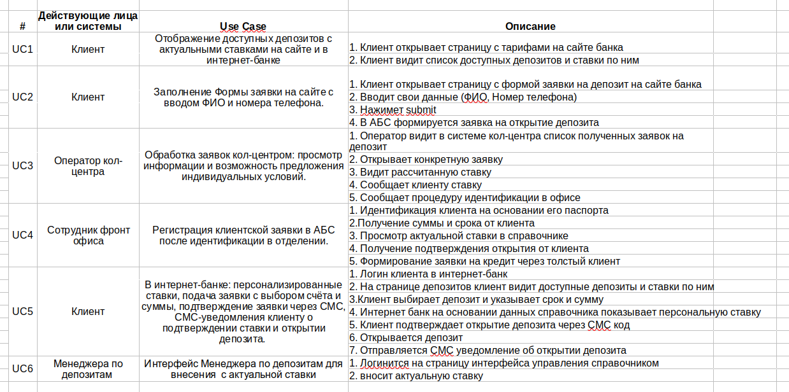
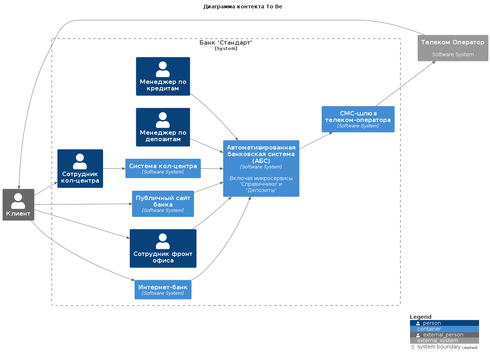
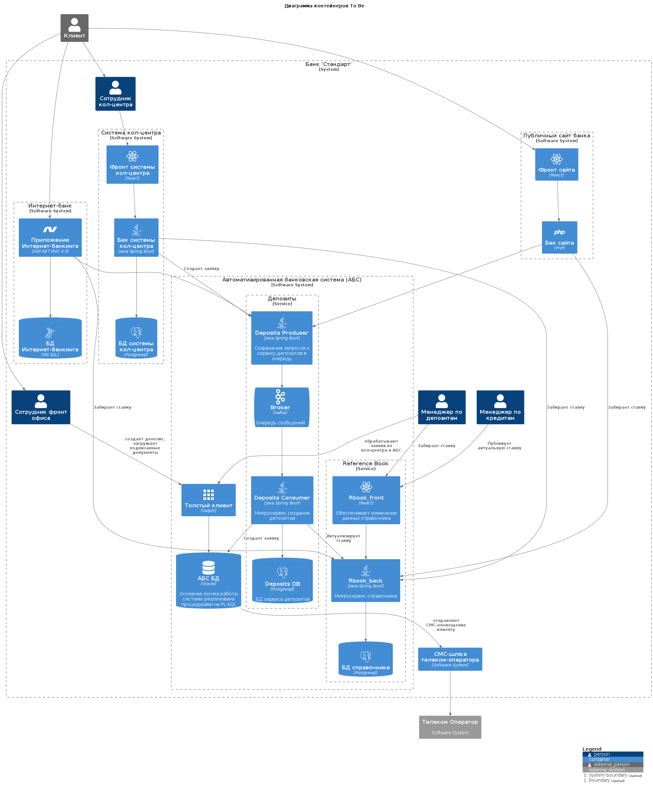

### **Название задачи:** Добавление функции удаленного открытия депозитов
### **Автор:** Алексей
### **Дата:**  13.05.2025
### **Функциональные требования**
Опишите здесь верхнеуровневые Use Cases. Их нужно оформить в виде таблицы с пошаговым описанием:

### **Нефункциональные требования**
Опишите здесь нефункциональные требования и архитектурно-значимые требования.

|**№**|**Требование**|
| :-: | :- |
|1|Коэффициент доступности 99.9% |
|2|Надёжная обработка данных заявок: отсутствие потерь при сбоях|
|3|Целевая максимальная нагрузка до 500rps|
|4|Время загрузки любой страницы не более 1с|
|5|Переиспользование существующего СМС провайдера, доработку интеграции выполнять силами сотрудников банка |

### **Решение**
Приведите диаграммы контекста и контейнеров в модели C4. Опишите там основные компоненты и интеграции всех элементов решения. 

Также опишите, какой логикой вы руководствовались в ходе принятия решений и выбора технологий. Не забывайте, что необходимо учесть все функциональные и нефункциональные требования.

Так как БД Oracle перегружена, недопустимо добавление в нее нового функционала связанного с розничными клиентами, которые могут начать расти лавинообразно в любой момент - нужно сначала разгрузить БД Oracle.

Для разгрузки БД Oracle добавлен сервис "Справочники" (Reference Book), который забирает часть работы Oracle и обеспечивает предоставление общей справочной информации всем заинтересованным элементам системы.

Для добавления нового функционала добавлен сервис "Deposits", который обеспечивает гарантированную асинхронную доставку запросов клиентов за счет брокера сообщений и защищает Oracle от перегрузки.

Использование микросервисов позволит сразу заложить возможность использования горизонтального масштабирования.
Для сервиса Справочники в дальнейшем, при необходимости, можно внедрить кэширование ответов.

Микросирвис Deposits Producer должен обеспечивать подключение в том числе .Net клиентов

### **Альтернативы**
Опишите здесь наиболее важные альтернативные решения.

В качестве альтернативы можно попробовать в рамках MVP обеспечить требуемый функционал в рамках реализации дополнительных процедур БД Oracle.

В таком случае можно обойтись без добавления микросервисов и отложить вопросы масштабирования на следующие после MVP этапы.

Но т.к. БД Oracle уже перегружена, добавление функций в БД создает риск как для розничного направления банка, так и для всего ядра банка => в рамках MVP необходимо сразу добавлять микросервисы.

**Недостатки, ограничения, риски**

Подробно опишите здесь недостатки, ограничения и риски выбранного решения.

- Большие трудозатраты в рамках MVP на разработку двух микросервисов.
- Существенное увеличение требований к используемым вычислительным мощьностям.
- Усложнение инфраструктуры.
- Усложнение CI/CD.
- Усложнение мониторинга.
- Потребуется усиление эксплутационного подразделения.
- Риск затягивание сроков реализации MVP
- АБС может масштабироваться только вертикально, что делает ее узким местом.
