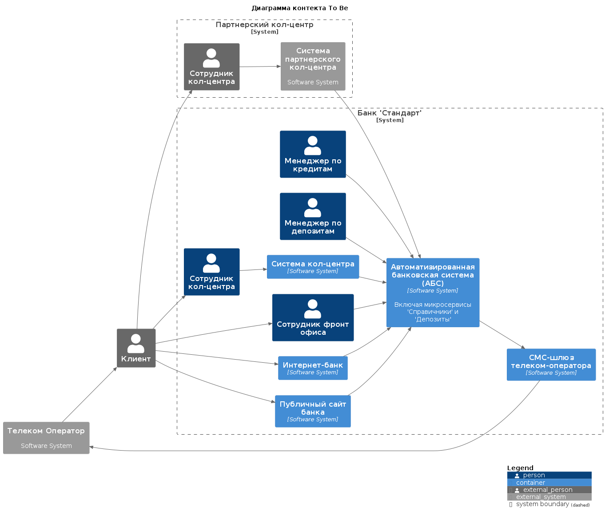
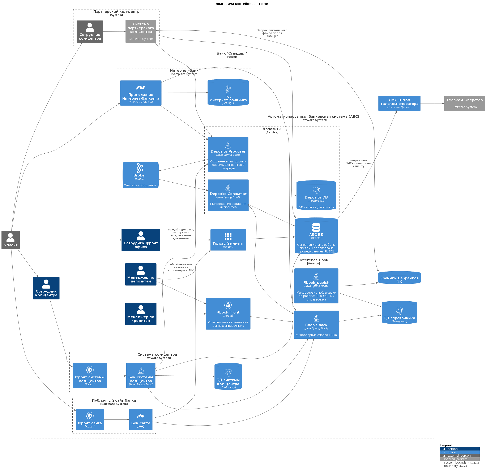

### **Название задачи:** Актуализация данных партнерского кол-центра
### **Автор:** Алексей
### **Дата:** 14.05.2025
### **Функциональные требования**
Опишите здесь верхнеуровневые Use Cases. Их нужно оформить в виде таблицы с пошаговым описанием:

|**№**|**Действующие лица или системы**|**Use Case**|**Описание**|
| :-: | :- | :- | :- |
|UC1| Оператор партнерского кол-центра| Консультация клиента по ставкам| 1. Оператор открывает справочный файл по актуальным ставкам и передает информацию клиенту|
### **Нефункциональные требования**
Опишите здесь нефункциональные требования и архитектурно-значимые требования.

|**№**|**Требование**|
| :-: | :- |
|1|Минимальная задержка предоставления данных партнеру|
|1|Партнер готов делать только файловую интеграцию|
### **Решение**
Приведите диаграммы контекста и контейнеров в модели C4. Опишите там основные компоненты и интеграции всех элементов решения. 

Т.к. партнер настаивает на файловой интеграции, необходимо публиковать файл с актуальной выгрузкой из Справочника.

Для формирования выгрузки необходимо реализовать микросервис Публикации, который будет читать лог БД Справочника и при изменении требуемых данных будет формировать новую выгрузку и размещать его в хранилище.

Для минимизации проблем с версиями файлов, хранилище реализовано в виде git репозитория.

Кол-центр регулярно через ssh подключение делает git pull и в случае обновления рассылает файл операторам по почте.

Также опишите, какой логикой вы руководствовались в ходе принятия решений и выбора технологий. Не забывайте, что необходимо учесть все функциональные и нефункциональные требования.
### **Альтернативы**
Опишите здесь наиболее важные альтернативные решения.

Формирование файла можно реализовать внутри Rbook_back.

В дальнейшем, при реализации полноценной интеграции, данный функционал потребуется вырезать, тогда как, в случае отдельного микросервиса публикации, достаточно просто выключить микросервис публикации и хранилище, доработки Rbook_back не потребуется.

**Недостатки, ограничения, риски**

Подробно опишите здесь недостатки, ограничения и риски выбранного решения.

- Нет гарантированной доставки.
- Операторы могут использовать устаревшие данные.
